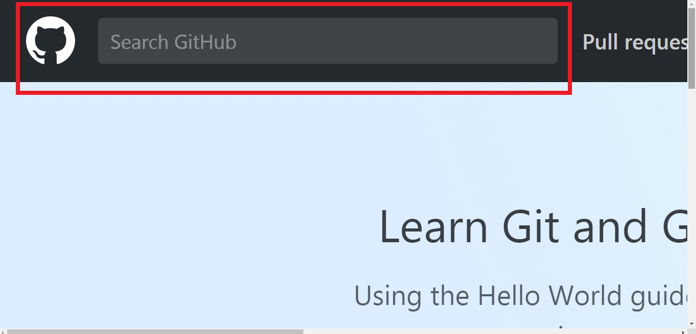
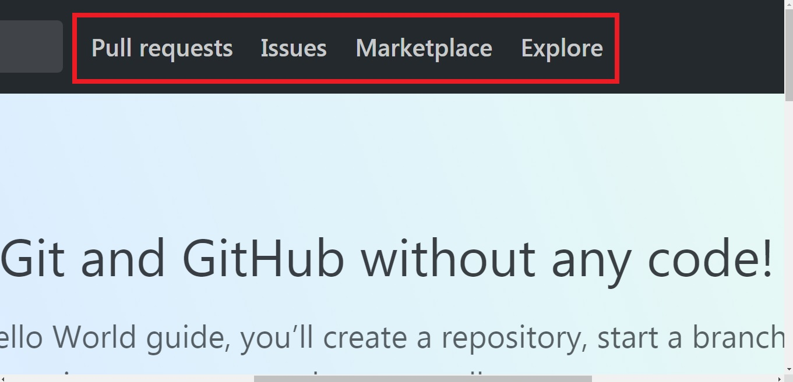
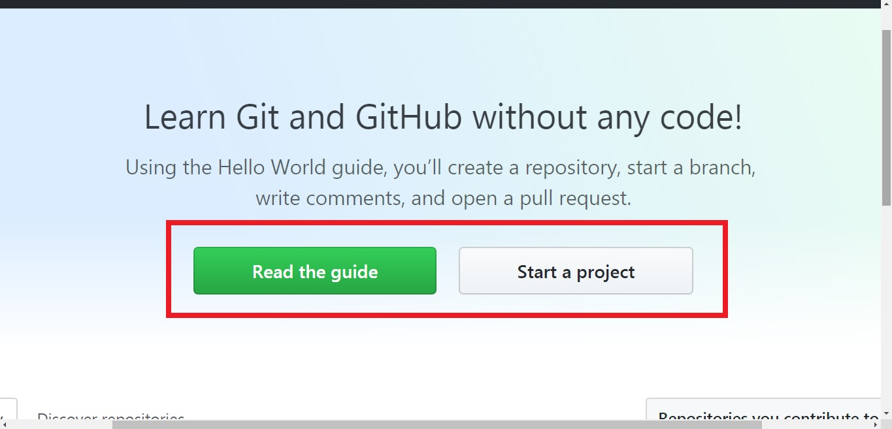
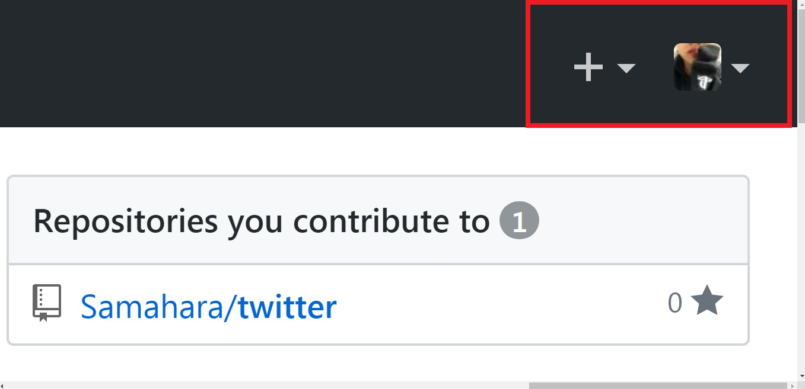
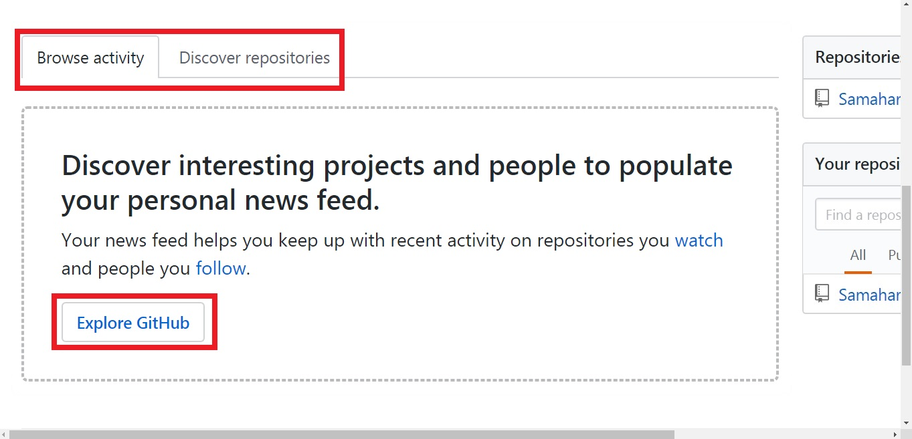
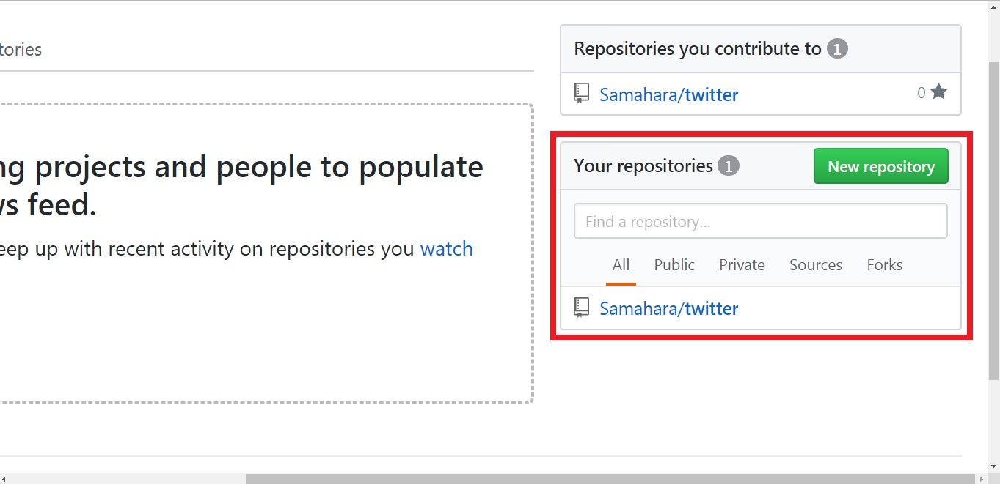
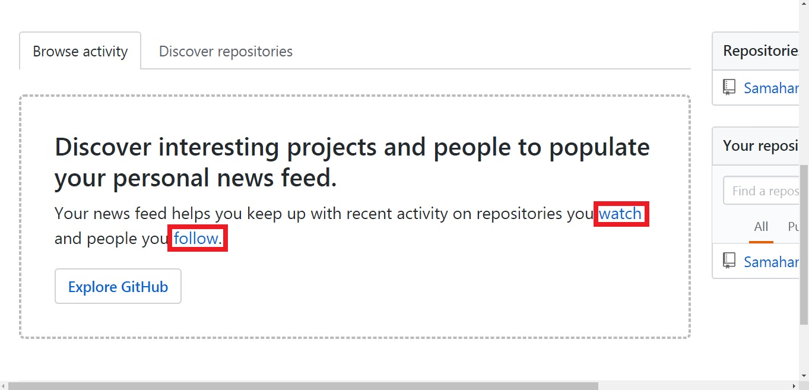
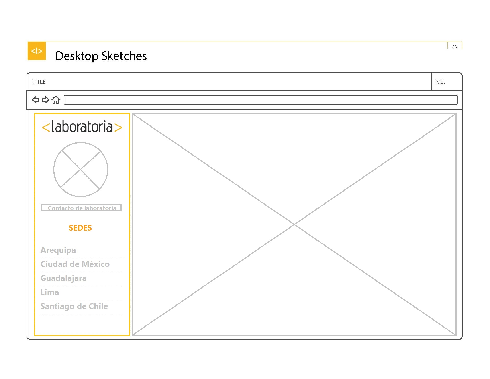
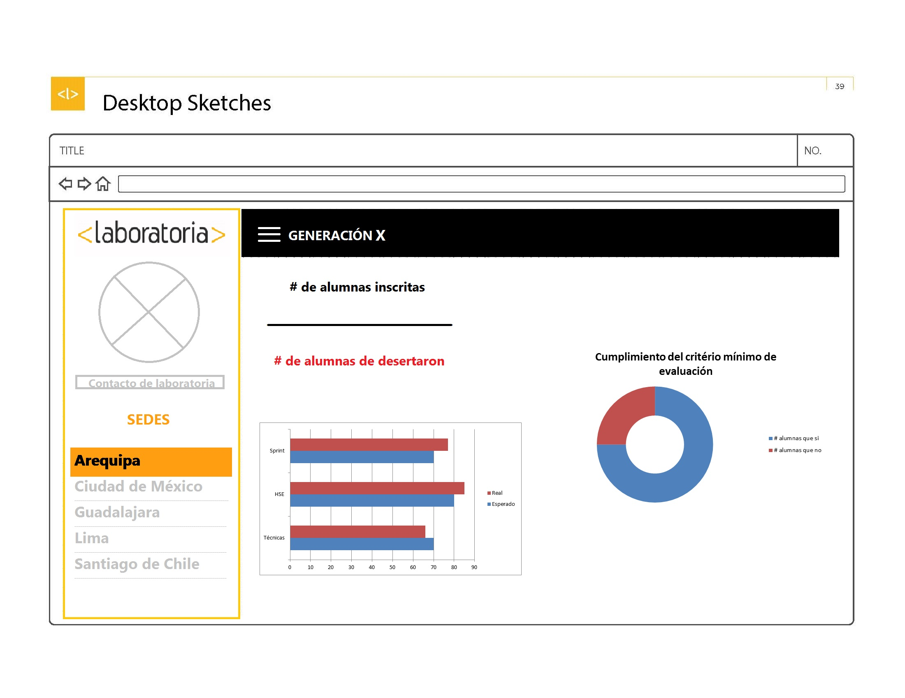
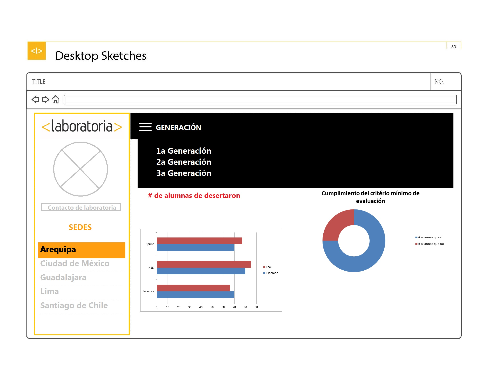

# INTRO A USER EXPERIENCE DESIGN

## 1. Qué partes conforman el *UX* y qué partes el *UI* en la página de [LABORATORIA](http://www.laboratoria.la).

## 2. Qué elementos de *navegación* conforman la página de [GITHUB](https://github.com).

#### Navegación facetada

#### Navegación global

#### Navegación local y suplementaria

#### Navegación filtrada

#### Navegación inline

## 3. *SKETCH* para la herramienta del dashboard de laboratoria.

#### Pantalla Principal

#### Selección de sede

#### Selección de Generación

